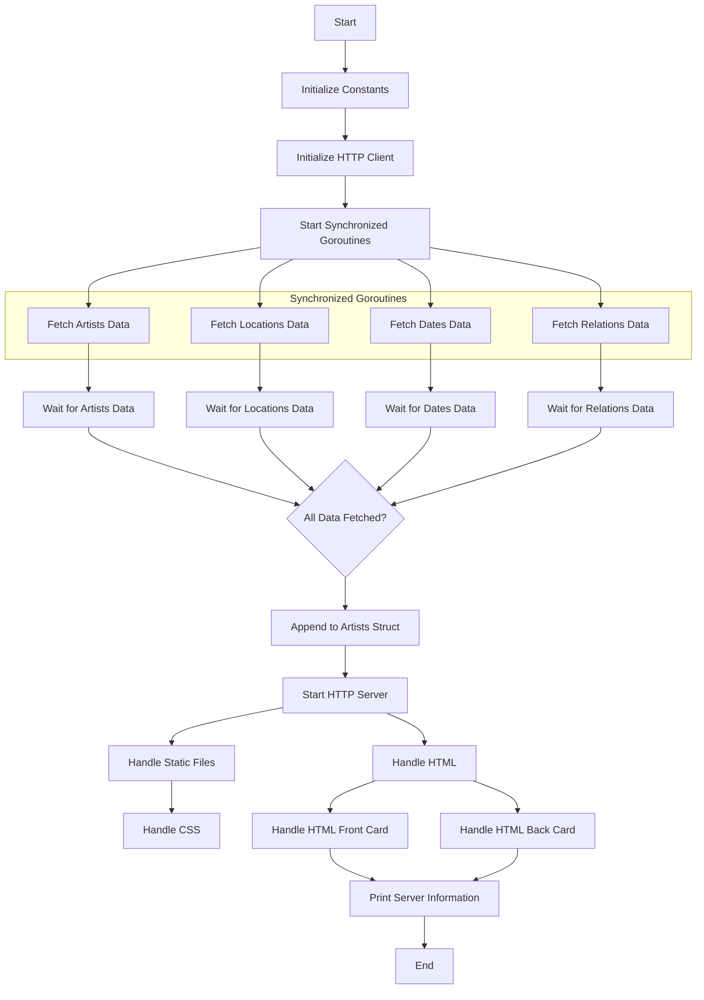

# Groupie Tracker Application Flow

```mermaid
flowchart TD
    A[Start] --> B[Initialize Constants]
    B --> C[Initialize HTTP Client]
    C --> D[Start Synchronized Goroutines]
    D --> E[Get Artists Data]
    D --> F[Get Locations Data]
    D --> G[Get Dates Data]
    D --> H[Get Relations Data]
    E --> I[Wait for Artists Data]
    F --> J[Wait for Locations Data]
    G --> K[Wait for Dates Data]
    H --> L[Wait for Relations Data]
    I --> M{All Data Fetched?}
    J --> M{All Data Fetched?}
    K --> M{All Data Fetched?}
    L --> M{All Data Fetched?}
    M --> N[Append to Artists Struct]
    N --> O[Start HTTP Server]
    O --> P[Handle Static Files]
    O --> Q[Handle HTML]
    P --> R[Handle CSS]
    Q --> S[Handle HTML Front Card]
    Q --> T[Handle HTML Back Card]
    S --> U[Print Server Information]
    T --> U
    U --> V[End]

    subgraph Synchronized Goroutines
        E[Fetch Artists Data]
        F[Fetch Locations Data]
        G[Fetch Dates Data]
        H[Fetch Relations Data]
    end
```
